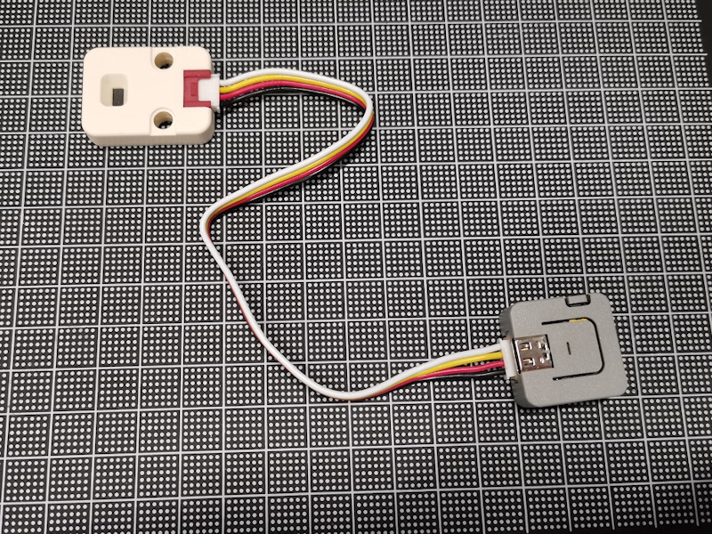
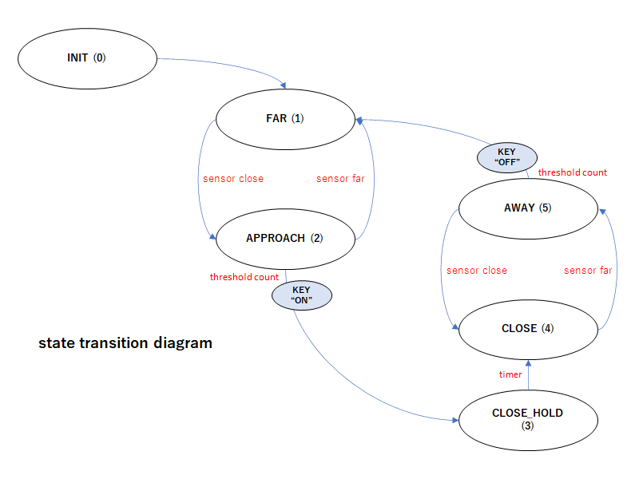

# M5Atom-TOF-BTKey

非接触距離センサーを使った単機能スイッチ (Bluetoothキーボードエミュレーション)

## 機能

- センサーから特定の距離内に物体(人)を検知した場合に、PCに対して特定のキーコードを送信します。
- 光学センサーを使用し、センサーから約2mの範囲を検出します。
- PCからはBluetooth Keyboardとして認識され、PC側に特別なプログラムは必要ありません。
- 複数のセンサーを同時に利用することができます。
- 展示会のデモンストレーションなどでの利用を想定しています。

## 使用ハードウェア

- M5Atom Lite
  - https://docs.m5stack.com/en/core/atom_lite
  - https://www.switch-science.com/products/6262
- M5 TOF Sensor (VL54L0X)
  - https://docs.m5stack.com/en/unit/tof
  - https://www.switch-science.com/products/5219



## 使用方法

- M5Atom LiteのGrove端子にTOFセンサーを接続します
- M5AtomにUSB-Type Cケーブルで電源を供給します
- PCでBluetoothデバイスの追加を選ぶと"M5Atom KBD 1"というBluetoothキーボードデバイスが見つかるので、ペアリングします (パスコードの入力は不要です)
- センサーの前(デフォルトでは1.5m程度)に物体が検出されると、キーボードから"1"が入力されます
- センサーの前の物体がなくなると、キーボードから"0"が入力されます
- 一度"1"が出力されると、5秒間はその状態を維持します(5秒以降に"0"が送信されます)

### カスタマイズ
- 送信するキーコードを変更する場合は、ソースコードの以下の箇所を書き換えてください
```
#define BLEKEY_ON   '1'
#define BLEKEY_OFF  '0'
```
- Blueeoothデバイス名を変更する場合は以下の箇所を書き換えてください (複数のセンサーを同時に使用する場合は名前が重ならないようにしてください)
```
#define BLEKEY_DEVICENAME "M5Atom KBD 1"
```
- 検出する距離を変更する場合は以下の箇所を書き換えてください (このセンサーの最大検出距離は約2mです)
```
#define THRESHOLD_DISTANCE  1500  // mm
```

## コンパイル方法
- Arduino IDEをインストールして、M5Atomの開発環境を整えてください
  - https://docs.m5stack.com/en/quick_start/atom/arduino

- Adafruit_VL53L0Xをインストールしてください
  - Arduino IDE -> ツール -> ライブラリマネージャ
  - "Adafruit_VL53L0X"を検索してインストール
  - 参考: https://github.com/adafruit/Adafruit_VL53L0X

- NimBLEをインストールしてください
  - Arduino IDE -> ツール -> ライブラリマネージャ
  - "NimBLE"を検索してインストール
  - 参考: https://github.com/h2zero/NimBLE-Arduino

- ESP32 BLE Keyboard libraryをインストールしてください
  - https://github.com/T-vK/ESP32-BLE-Keyboard/archive/refs/heads/master.zip
  - Arduino IDE -> スケッチ -> ライブラリをインクルード -> .ZIP形式のライブラリをインストール
  - 上記ZIPファイルをインストール
  - 参考: https://github.com/T-vK/ESP32-BLE-Keyboard
  - インストールされたライブラリの中で、以下の行のコメントを外して有効にしておく (NimBLEを使う)
  ``` Arduino\libraries\ESP32-BLE-Keyboard\BleKeyboard.h
  #define USE_NIMBLE
  ```

- M5Atom-TOF-BTKeyのソースコードを展開する
- コンパイルし、M5Atom Liteに書き込む

### 動作確認
USB Serialに状態遷移のログを出力しています

## 参考情報
### 状態遷移図



